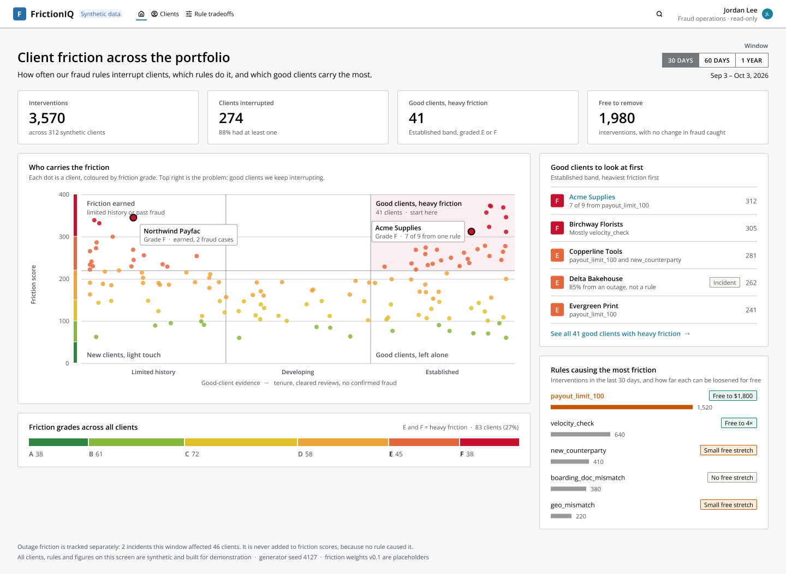

# FrictionIQ — measuring what fraud controls cost good clients

JPM hackathon entry (submission **Oct 6, 2026**, category: Decision Intelligence).

Fraud rules are measured on what they catch: hit rates, precision, recall, losses prevented. Nobody measures
what they cost the legitimate client on the other side, so rules get tuned on one axis only. FrictionIQ makes
client friction a number, attributes it to the rule that caused it, and draws the curve that shows how much
friction a rule relaxation removes and what it costs in fraud caught.

## What it does

1. **A friction score per client.** Every intervention a client received (deny, hold, settlement limit,
   restriction), weighted by severity and recency, each tagged with the rule that caused it. Shown as an
   A–F friction grade with its range across weightings.
2. **A tradeoff curve per rule.** Sweep the rule's threshold, re-run the whole population, and plot friction
   removed against fraud still caught. The flat stretch, where friction falls and fraud caught doesn't, is the
   finding.

It recommends; it never changes a live rule. The path to production is a shadow-mode copy of the rule at the
relaxed threshold, logging what it would have done without touching a client.

## The demo

Open on **Acme Supplies**: 38 months, never a confirmed fraud case, 9 interventions in 30 days, 7 of them from
one rule (`payout_limit_100`, which denies or holds payouts over $100, while Acme's normal payout is about $150).
Switch to that rule's curve and drag the threshold to $500: 1,230 fewer interventions for 196 clients, and the
same 148 fraud cases caught. Then show a rule with no free stretch, because some rules earn their friction.

## Links

| What | Where |
|---|---|
| **Figma — screens** | https://www.figma.com/design/iXDUVq6xs7RFJiSkXe7Ovk (page **⭐ FrictionIQ — Screens**) |
| Design notes | [`design/README.md`](design/README.md) |
| Mock data used on screen | [`data/frictioniq-mock.json`](data/frictioniq-mock.json) |

The Figma file is built on J.P. Morgan's open-source [Salt Design System](https://www.saltdesignsystem.com/).
Figma access is by invite. If the link says you don't have access, ask Anisha to share the file.

## Screens

| # | Screen | Export |
|---|---|---|
| 1 | Home: friction across the portfolio, good clients with heavy friction | [png](design/screens/1-home.png) |
| 2 | Client friction detail (Acme Supplies) | [png](design/screens/2-client-acme.png) |
| 3 | Rule tradeoff explorer (`payout_limit_100`) | [png](design/screens/3-rule-tradeoff.png) |

## Data

Everything in this repo is **synthetic**: fictional clients, rules, thresholds and outcomes, built for
demonstration. No client data, PII, transaction records or live rule content belongs here.
