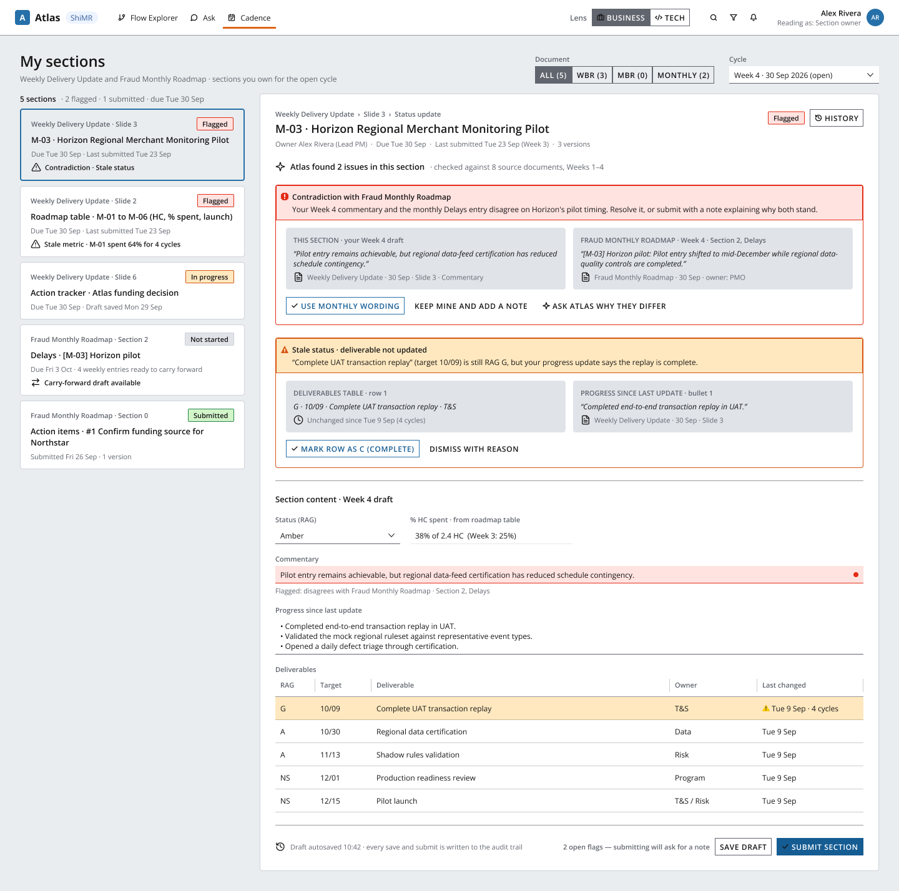

# Atlas — screen designs

Screens are designed in Figma on top of J.P. Morgan's open-source **Salt Design System**
(community file "Salt DS Components and Patterns"), so they map straight onto
[`@salt-ds/core`](https://www.saltdesignsystem.com/) components when we build.

**Figma file:** https://www.figma.com/design/iXDUVq6xs7RFJiSkXe7Ovk — page **⭐ Atlas — Screens**

All content in these designs is fictional mock data (see [`../data/cadence-mock.json`](../data/cadence-mock.json)).

## Screens

| Screen | Status | Figma node | Export |
|---|---|---|---|
| Cadence — My sections | Done | [51310:2](https://www.figma.com/design/iXDUVq6xs7RFJiSkXe7Ovk?node-id=51310-2) | [png](screens/cadence-my-sections.png) |
| Flow Explorer (Business / Tech lens) | Next | — | — |
| Node drawer — restricted vs Risk Strategy | Planned | — | — |
| Ask — cited answer + walkthrough | Planned | — | — |

## Salt settings

| Setting | Value | Why |
|---|---|---|
| Density | **Medium** (28px controls, 8/16/24px spacing, 12px body) | The file default is High density, which is too small for a 1440px demo |
| Theme | **Legacy (UITK)** | JPM Brand theme needs the Amplitude font, which isn't installed; Legacy uses Open Sans throughout. Switch to JPM Brand if Amplitude is available |
| Width | 1440px, desktop only | FRD: mobile out of scope |

Colours, spacing and radii are bound to Salt tokens (e.g. `container/primary-background`,
`status/error-border`, `separable/primary-border`), not hard-coded.

## Salt components used

- **Header:** Transparent tab, Tag, Toggle button (lens), Neutral button (icon-only), Avatar
- **Toolbar:** Toggle button (document selector), Dropdown (cycle)
- **Editor:** Error / Warning banner (flags), Accented + Neutral buttons, Dropdown, Multiline input (incl. error status), Table cell (header/body)

## Atlas-specific components (local to the Figma file)

- `Atlas/Section state` — Flagged · In progress · Submitted · Not started (FRD module 9), bound to Salt status tokens
- `Atlas/Section row` — one owned section in the Cadence list; text props for doc, title, meta, flag summary; `Selected` variant
- `icon/*` — Lucide icons (the FRD specifies Lucide): git-branch, message-circle, calendar-check, sliders-horizontal, briefcase, code-2, search, filter, bell, history, arrow-right-left, check, alert-triangle, split, clock, file-text, external-link, chevron-down, sparkles, user-circle, shield-check, lock

## Cadence screen → requirements

| On screen | FRD |
|---|---|
| Admin tab absent for the Section owner role | 3.1 |
| Role always visible in the header | 3 (additional requirements) |
| Document selector (WBR · MBR · Monthly), cycle selector defaulting to the open cycle | 9, 9.8 |
| Section list shows only the user's sections, state per section per cycle | 9 |
| Contradiction flag: both statements side by side with sources | PRD "Reporting cadence" signals |
| Stale status / stale metric flags with the date that expired | PRD signals, 9 |
| Carry-forward available on the Monthly section with 4 weekly entries | 9.5 (stretch) |
| History button, audit note in the submit bar | 9.6, 9.7 |
