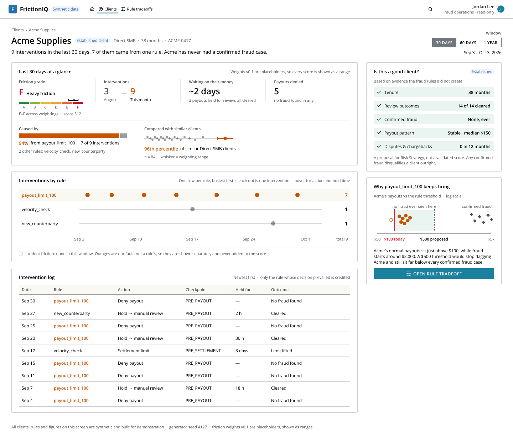
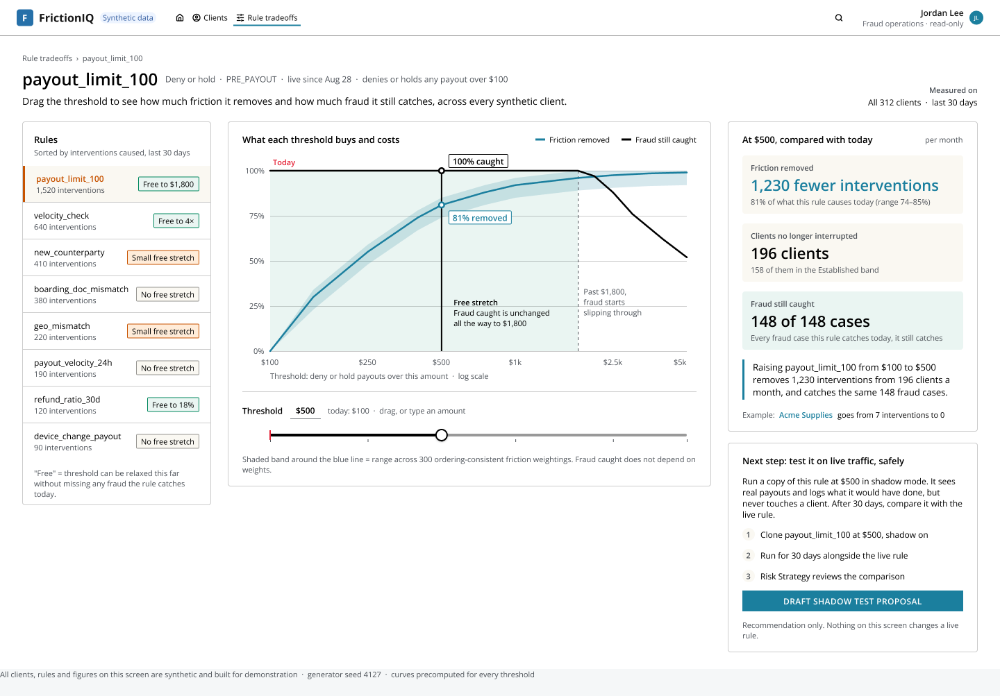
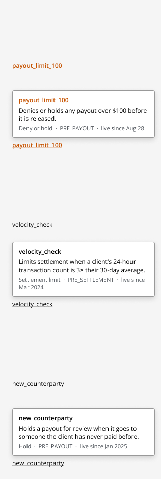

# FrictionIQ — screen designs

Three screens, designed in Figma on J.P. Morgan's open-source **Salt Design System**
(Medium density, Legacy theme, Open Sans, 1440px).

**Figma file:** https://www.figma.com/design/iXDUVq6xs7RFJiSkXe7Ovk — page **⭐ FrictionIQ — Screens**.
Press Present (▶): the prototype starts on Home and the screens are linked.

All content is synthetic (see [`../data/frictioniq-mock.json`](../data/frictioniq-mock.json)).

## Screens

| # | Screen | Answers | Figma node | Export |
|---|---|---|---|---|
| 1 | Home (portfolio) | How big is this, and where do I look first? | [51340:85](https://www.figma.com/design/iXDUVq6xs7RFJiSkXe7Ovk?node-id=51340-85) | [png](screens/1-home.png) |
| 2 | Client friction detail (Acme Supplies) | Is this good client being over-challenged, and by which rule? | [51324:412](https://www.figma.com/design/iXDUVq6xs7RFJiSkXe7Ovk?node-id=51324-412) | [png](screens/2-client-acme.png) |
| 3 | Rule tradeoff explorer (`payout_limit_100`) | How much friction does relaxing this rule remove, and what fraud does it cost? | [51337:55](https://www.figma.com/design/iXDUVq6xs7RFJiSkXe7Ovk?node-id=51337-55) | [png](screens/3-rule-tradeoff.png) |

Demo path: Home → click Acme (top-right quadrant) → screen 2 → "Open rule tradeoff" → screen 3, threshold at $500.

### 1 — Home

### 2 — Client friction detail

### 3 — Rule tradeoff explorer

## Design decisions

| Decision | Why |
|---|---|
| **Friction grade A–F** (green → red) instead of a raw score | A letter reads in a second. Labelled "Friction grade" so F means "we put this client through heavy friction", not "bad client". Always shown with its range across weightings (e.g. "E–F") |
| **Grade colours are separate from the rule orange** | Orange (Salt `status/warning-foreground-decorative`) marks the rule causing the friction; the A–F scale uses its own six colours so the two never get confused |
| **One lane per rule** for the client timeline | A single row breaks at ~30 interventions (overlap, unreadable labels, too many colours). Lanes sort busiest rule to the top, so "who caused this" is the first row |
| **Only two encodings** on the timeline: position = date, colour = rule | Height, width and fade (severity, hold duration, recency) were too much to read at a glance; those details live in the log and tooltips |
| **No before/after lane on the client screen** | The counterfactual belongs to screen 3's slider, not a spoiler on screen 2 |
| **Real units next to the score** ("~2 days waiting on their money", "5 payouts denied") | Countable costs are easier to feel and defend than invented points |
| **Interventions as "3 → 9"** (August → this month) | Replaced a ↑3× + sparkline combo that was confusing |
| **Outage friction kept out of every score** | It was caused by us, not a rule; shown as a separate note and an "Incident" tag |
| **Curve shows a band, not a line** | The band is the range across ordering-consistent weightings, so nobody reads 81% as a measurement |
| **"Free stretch" named on the chart** and in the rule list | The flat part of the curve is the finding; naming it means the viewer doesn't have to infer it |
| **Slider aligned to the chart's x-axis** | The thumb sits exactly under the point it selects on the curve |
| **Recommendation only** | Screen 3 ends in a shadow-mode test proposal; nothing on screen changes a live rule |

## Components

- **Salt (from the file):** Transparent tab, Tag, Neutral button (icon-only), Avatar, colour tokens for every surface, border and text
- **Hand-built with Salt tokens** (Salt's own versions use the Amplitude font, which isn't installed): primary buttons, the 30 days / 60 days / 1 year toggle group
- **`FrictionIQ / Rule cell`** — rule name in the intervention log; Hover variant shows a tooltip with what the rule does, its decision, checkpoint and live date. Wired as a prototype hover interaction
  
- **`icon/home`** — Lucide house, added alongside the existing Lucide icons

## Open items

- All figures are placeholders. Replace with the seeded generator output (schema in the PRD; values to match in `data/frictioniq-mock.json`)
- Grade cutoffs are placeholders; alternative is peer-relative grades (e.g. F = worst 10%)
- Second tradeoff view with no free stretch (`boarding_doc_mismatch`) for the "some rules earn their friction" demo beat
- Figma can't make the slider move; the live slider is the HTML build reading precomputed results
